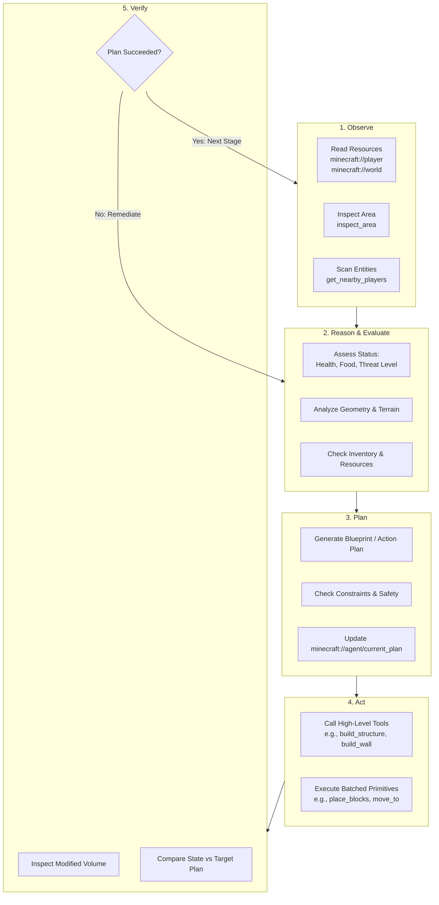
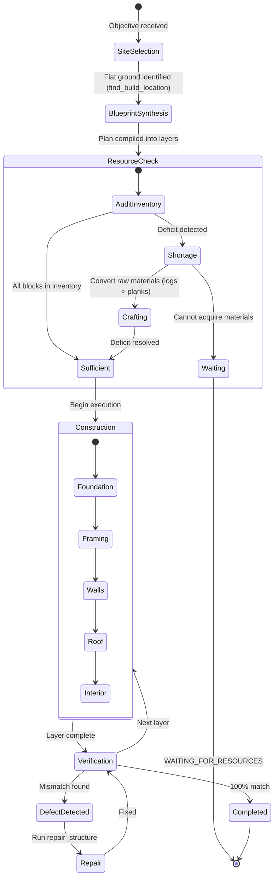

# Autonomous Agents Architecture

This document describes the design, cognitive patterns, state machines, and operational loops for autonomous LLM agents operating within Minecraft Java Edition using the MCP 2.0 server.

---

## 1. The Core Agent Loop: O-R-P-A-V

All autonomous Minecraft agents follow the closed-loop **Observe $\rightarrow$ Reason $\rightarrow$ Plan $\rightarrow$ Act $\rightarrow$ Verify** cycle:



---

## 2. Autonomous Building Agent

The Building Agent is responsible for end-to-end structure creation, from terrain analysis to architectural synthesis, foundation placement, framing, and final inspection.

### Architectural Phases

#### Phase 1: Site Survey & Location Selection
1. Queries `find_build_location(width=15, depth=15, max_slope=0.15)`.
2. Inspects candidates using `inspect_area(center=pos, radius=8, format="summary")`.
3. Selects the area with the highest flatness score and lowest clearing cost.

#### Phase 2: Blueprint Synthesis
1. Synthesizes a hierarchical blueprint specification:
   ```yaml
   house:
     style: "oak_cabin"
     origin: [120, 65, -200]
     dimensions: { width: 9, depth: 7, height: 5 }
     materials:
       foundation: "minecraft:cobblestone"
       walls: "minecraft:oak_planks"
       corners: "minecraft:oak_log"
       floor: "minecraft:spruce_planks"
       roof: "minecraft:oak_stairs"
       glass: "minecraft:glass_pane"
       door: "minecraft:oak_door"
   ```
2. Writes the blueprint to the MCP state resource: `minecraft://agent/current_plan`.

#### Phase 3: Site Preparation & Foundation
1. Clears obstructions (leaves, tall grass, trees) in the bounding box using `fill_region(..., block="minecraft:air")`.
2. Levels the terrain and lays the subfloor foundation via `build_floor`.

#### Phase 4: Structural Construction
1. Executes `build_wall` for North, South, East, and West walls.
2. Injects corner pillars using vertical log columns.
3. Carves openings and installs fixtures via `build_door` and `build_window`.
4. Caps the structure using `build_roof(style="pitched")`.
5. Places interior lighting (`minecraft:torch` or `minecraft:lantern`) to prevent mob spawns inside.

#### Phase 5: Verification & Remediation
1. Calls `inspect_area(center=origin, radius=10, format="compact")`.
2. Detects any misplaced blocks, accidental air gaps, or missing roof segments.
3. Fires targeted `place_block` or `break_block` corrections.
4. Marks `minecraft://agent/current_plan` status as `completed`.

---

## 3. Autonomous Architectural Planning Agent

The Architectural Planning Agent handles blueprint synthesis, resource acquisition, construction sequencing, and layered building across diverse typologies (towers, bridges, walls, castles, farms, houses, temples, and custom designs).



---

## 4. Structural Restoration & Repair Agent

The Structural Restoration Agent safeguards existing structures against natural or hostile damage (creeper craters, accidental breaks, water intrusion):

1. **Periodic Audit**: Reads known structures from `minecraft://world/map`.
2. **Ground-Truth Scan**: Samples active coordinates via `get_block` / `get_blocks`.
3. **Discrepancy Identification**: Identifies missing blocks or unwanted debris.
4. **Targeted Patching**: Invokes `repair_structure` to clear obstacles and replace missing blocks with designated materials.
5. **Re-Verification**: Confirms 100% structural fidelity.

---

## 5. Agent Memory & Resumption

Network disconnects, server restarts, or context truncations must not wipe the agent's progress.

### State Resource: `minecraft://agent/current_plan`
The agent periodically writes its active project state to this resource:
```json
{
  "agent_id": "architect_01",
  "task": "build_house",
  "status": "in_progress",
  "stage": "roofing",
  "origin": [120, 65, -200],
  "dimensions": {"width": 9, "depth": 7, "height": 5},
  "completed_stages": [
    "site_survey",
    "foundation",
    "walls",
    "doors_and_windows"
  ],
  "remaining_stages": [
    "roofing",
    "interior_lighting",
    "quality_verification"
  ],
  "last_checkpoint_timestamp": 1773789000
}
```

When waking up, the agent reads `minecraft://agent/current_plan`. If an active task is found, it resumes from the next remaining stage without rebuilding or repeating previous work.

