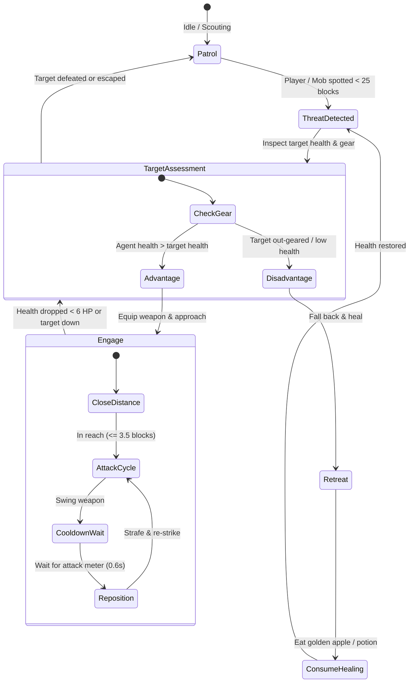

# Autonomous Agents Architecture

This document describes the design, cognitive patterns, state machines, and operational loops for autonomous LLM agents operating within Minecraft Java Edition using the MCP 2.0 server.

---

## 1. The Core Agent Loop: O-R-P-A-V

All autonomous Minecraft agents follow the closed-loop **Observe $\rightarrow$ Reason $\rightarrow$ Plan $\rightarrow$ Act $\rightarrow$ Verify** cycle:


---

## 2. Autonomous Building Agent

The Building Agent is responsible for end-to-end structure creation, from terrain analysis to architectural synthesis, foundation placement, framing, and final inspection.

### Architectural Phases

#### Phase 1: Site Survey & Location Selection
1. Queries `find_build_location(width=15, depth=15, max_slope=0.15)`.
2. Inspects candidates using `inspect_area(center=pos, radius=8, format="summary")`.
3. Selects the area with the highest flatness score and lowest clearing cost.

#### Phase 2: Blueprint Synthesis
1. Synthesizes a hierarchical blueprint specification:
   ```yaml
   house:
     style: "oak_cabin"
     origin: [120, 65, -200]
     dimensions: { width: 9, depth: 7, height: 5 }
     materials:
       foundation: "minecraft:cobblestone"
       walls: "minecraft:oak_planks"
       corners: "minecraft:oak_log"
       floor: "minecraft:spruce_planks"
       roof: "minecraft:oak_stairs"
       glass: "minecraft:glass_pane"
       door: "minecraft:oak_door"
   ```
2. Writes the blueprint to the MCP state resource: `minecraft://agent/current_plan`.

#### Phase 3: Site Preparation & Foundation
1. Clears obstructions (leaves, tall grass, trees) in the bounding box using `fill_region(..., block="minecraft:air")`.
2. Levels the terrain and lays the subfloor foundation via `build_floor`.

#### Phase 4: Structural Construction
1. Executes `build_wall` for North, South, East, and West walls.
2. Injects corner pillars using vertical log columns.
3. Carves openings and installs fixtures via `build_door` and `build_window`.
4. Caps the structure using `build_roof(style="pitched")`.
5. Places interior lighting (`minecraft:torch` or `minecraft:lantern`) to prevent mob spawns inside.

#### Phase 5: Verification & Remediation
1. Calls `inspect_area(center=origin, radius=10, format="compact")`.
2. Detects any misplaced blocks, accidental air gaps, or missing roof segments.
3. Fires targeted `place_block` or `break_block` corrections.
4. Marks `minecraft://agent/current_plan` status as `completed`.

---

## 3. Autonomous Combat / PvP Agent

The Combat Agent handles tactical combat against hostile mobs or other players without relying on cheat commands (such as `/kill`).



### Key Tactical Rules for Minecraft Java 26.2
- **Weapon Cooldown Meter**: In Java Edition 1.9+, spamming attack clicks reduces weapon damage by up to 80%. The combat agent respects weapon recovery delay:
  - Diamond / Netherite Sword: 0.625 seconds (1.6 attack speed).
  - Axe: 1.0–1.25 seconds.
- **Critical Hits**: Timing attacks while falling down from a jump inflicts 150% base damage.
- **Shield Disabling**: If the target blocks with a shield, the agent switches to an axe to stun the shield for 5 seconds.
- **Retreat Heuristic**: If agent health drops below `6.0` (3 hearts), it automatically disengages, executes `retreat(distance=15)`, equips food/potions, and consumes them before re-evaluating.

---

## 4. Autonomous Sentry & Perimeter Defense Agent

The Defense Agent safeguards a designated perimeter or player:

1. **Perimeter Setup**: Establishes a home anchor $(X, Y, Z)$ and guard radius (e.g., $R = 20$ blocks).
2. **Subscription Listener**: Monitors `minecraft://players/nearby` and `minecraft://mobs/nearby`.
3. **Friend-or-Foe (IFF) Matrix**:
   - Hostile Mobs (Creeper, Skeleton, Zombie): Immediate interception. Creepers are targeted with hit-and-backstep tactics to prevent detonation.
   - Neutral Entities / Farm Animals: Ignored.
   - Players: Checked against a whitelist. If not whitelisted, alerts owner or enters defensive stance.
4. **Leash Enforcement**: If drawn more than $1.5 \times R$ away during pursuit, the agent disengages and navigates back to perimeter center.

---

## 5. Agent Memory & Resumption

Network disconnects, server restarts, or context truncations must not wipe the agent's progress.

### State Resource: `minecraft://agent/current_plan`
The agent periodically writes its active project state to this resource:
```json
{
  "agent_id": "architect_01",
  "task": "build_house",
  "status": "in_progress",
  "stage": "roofing",
  "origin": [120, 65, -200],
  "dimensions": {"width": 9, "depth": 7, "height": 5},
  "completed_stages": [
    "site_survey",
    "foundation",
    "walls",
    "doors_and_windows"
  ],
  "remaining_stages": [
    "roofing",
    "interior_lighting",
    "quality_verification"
  ],
  "last_checkpoint_timestamp": 1773789000
}
```

When waking up, the agent reads `minecraft://agent/current_plan`. If an active task is found, it resumes from the next remaining stage without rebuilding or repeating previous work.

