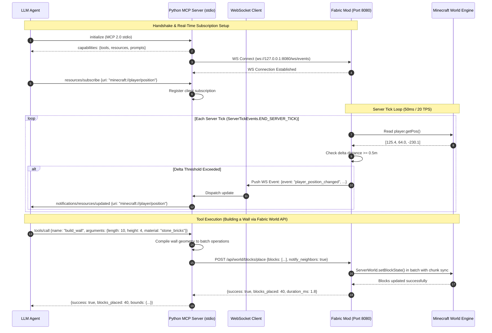

# System Architecture & Technical Design

This document details the core architecture of the **Minecraft Java Edition MCP Server 2.0**. It outlines how the Model Context Protocol (MCP) connects an autonomous Large Language Model (LLM) to a live Minecraft Java Edition world using a standard I/O (`stdio`) transport and a **server-side Fabric Mod bridge** over **localhost HTTP / WebSocket**, running on the **Fabric Server Launcher** for **Minecraft Java 26.2**.

---

## 1. High-Level Architecture (Option 2: Python + Fabric Mod)

The primary design principle is:
> **Do not expose Minecraft commands as the primary abstraction. Expose semantic capabilities.**

Rather than forcing the LLM to micromanage `/setblock`, `/fill`, or coordinate mathematics directly—or using high-latency, fragile RCON command parsing—the system uses a dedicated, high-performance server-side Fabric mod. The Python MCP server translates high-level agent intents into structured HTTP REST calls and receives real-time events over a WebSocket connection.

```
┌─────────────────────────────────────────────────────────────┐
│                     LLM Agent Client                        │
│   (e.g., Claude Desktop, Antigravity, Custom ReAct Loop)    │
└──────────────────────────────┬──────────────────────────────┘
                               │
                               │ JSON-RPC 2.0 over stdio
                               │ (Tools, Resources, Prompts, Subscriptions)
                               ▼
┌─────────────────────────────────────────────────────────────┐
│               Minecraft MCP Server (Python)                 │
│                                                             │
│  ┌─────────────────────────┐   ┌─────────────────────────┐  │
│  │     Tool Registry       │   │    Resource Manager     │  │
│  │  • High-Level Tools     │   │  • World State          │  │
│  │  • Primitives           │   │  • WebSocket Sub Engine │  │
│  └────────────┬────────────┘   └────────────┬────────────┘  │
│               │                             │               │
│  ┌────────────▼─────────────────────────────▼────────────┐  │
│  │              Capability & State Engine                │  │
│  │  • Spatial World Model & Flatness Analyzer            │  │
│  │  • Multi-Structure Blueprint Compiler                 │  │
│  │  • 3D A* Voxel Navigation                             │  │
│  │  • Resource Manager & Crafting Recovery               │  │
│  │  • Structure Verifier & Autonomous Repair             │  │
│  │  • WebSocket Event Consumer (Client)                  │  │
│  └────────────────────────────┬──────────────────────────┘  │
└───────────────────────────────┼─────────────────────────────┘
                                │
                                │ Localhost HTTP & WebSocket (Port 25585)
                                │ (Asynchronous, Type-Safe JSON Payloads)
                                ▼
┌─────────────────────────────────────────────────────────────┐
│       Fabric Server-Side Mod (`minecraft-mcp-bridge`)       │
│                                                             │
│  • Embedded Lightweight HTTP & WebSocket Server (Netty)    │
│  • Direct Thread-Safe Dispatch to Server Tick Loop          │
│  • Event Hooks: ServerTickEvents.END_SERVER_TICK            │
│  • Server APIs:                                             │
│    ├── World API (WorldMutationService setBlock/fill/break) │
│    ├── Entity API (ObservationService player/entities)      │
│    └── Action API (PlayerActionService move/teleport/rotate)│
└──────────────────────────────┬──────────────────────────────┘
                               │
                               │ Direct In-Process Java Calls
                               ▼
┌─────────────────────────────────────────────────────────────┐
│          Minecraft Java 26.2 Dedicated Server               │
│               (Fabric Server Launcher)                      │
└─────────────────────────────────────────────────────────────┘
```

---

## 2. Mermaid Sequence Flow



---

## 3. Communication Transports

### Standard I/O (`stdio`)
- Communicates with the MCP client (e.g., Claude Desktop, Antigravity) over standard input/output streams.
- **`stdout` is strictly reserved** for JSON-RPC 2.0 protocol traffic.
- Diagnostic logs and debug output are directed exclusively to `stderr`.

### Localhost HTTP & WebSocket Bridge
- **Base URL**: `http://127.0.0.1:8080`
- **WebSocket URL**: `ws://127.0.0.1:8080/ws/events`
- **Zero RCON Bottlenecks**: Avoids command text serialization, text output regex parsing, and RCON single-threaded locking.
- **Microsecond Latency**: Direct memory access to Minecraft data structures with thread-safe queuing onto the main server thread.

---

## 4. Fabric Mod Bridge API Specification

The Fabric server-side mod exposes a structured REST and WebSocket interface:

### 4.1. Server & Status Endpoints

#### `GET /api/status`
Returns server operational health, loaded dimension, tick rate, and connected players:
```json
{
  "connected": true,
  "minecraft_version": "26.2",
  "fabric_loader_version": "0.16.x",
  "tps": 20.0,
  "mspt": 14.2,
  "player_count": 1,
  "players": ["Steve"],
  "world_name": "world",
  "time": 6000,
  "weather": "clear"
}
```

### 4.2. Player & Entity Endpoints

#### `GET /api/player/{name}`
Fetches live player entity vitals directly from `ServerPlayerEntity`:
```json
{
  "name": "Steve",
  "uuid": "853c88fc-...",
  "health": 20.0,
  "max_health": 20.0,
  "food_level": 18,
  "saturation": 5.0,
  "position": {"x": 125.4, "y": 64.0, "z": -230.1},
  "rotation": {"yaw": -90.0, "pitch": 12.5},
  "dimension": "minecraft:overworld",
  "gamemode": "survival",
  "is_sneaking": false,
  "is_sprinting": false
}
```

#### `GET /api/player/{name}/inventory`
Returns exact inventory slot mappings and total item counts:
```json
{
  "player": "Steve",
  "held_slot": 0,
  "hotbar": [
    {"slot": 0, "id": "minecraft:diamond_sword", "count": 1, "damage": 0},
    {"slot": 1, "id": "minecraft:diamond_pickaxe", "count": 1, "damage": 42},
    {"slot": 2, "id": "minecraft:oak_planks", "count": 64}
  ],
  "totals": {
    "minecraft:oak_planks": 128,
    "minecraft:cobblestone": 64,
    "minecraft:diamond_sword": 1
  },
  "free_slots": 28
}
```

#### `GET /api/entities/nearby?x=125&y=64&z=-230&radius=32`
Scans entities in loaded chunks via `ServerWorld.getOtherEntities()`:
```json
[
  {
    "id": "entity-1248",
    "type": "player",
    "name": "Alex",
    "position": [132.1, 64.0, -225.4],
    "distance": 8.3,
    "health": 16.0,
    "is_hostile": false
  },
  {
    "id": "entity-1302",
    "type": "zombie",
    "name": "Zombie",
    "position": [128.0, 63.0, -220.0],
    "distance": 10.5,
    "health": 20.0,
    "is_hostile": true
  }
]
```

### 4.3. World & Block Endpoints

#### `POST /api/world/inspect`
Inspects a cuboid volume and returns a compact representation directly from `ServerWorld.getBlockState(BlockPos)`:
- **Request**:
  ```json
  {
    "center": [100, 64, 200],
    "radius": 8,
    "format": "summary"
  }
  ```
- **Response**:
  ```json
  {
    "center": [100, 64, 200],
    "radius": 8,
    "terrain": {
      "flatness": 0.94,
      "min_y": 63,
      "max_y": 65,
      "surface_material": "minecraft:grass_block"
    },
    "materials": {
      "minecraft:grass_block": 112,
      "minecraft:dirt": 64,
      "minecraft:stone": 30
    },
    "hazards": []
  }
  ```

#### `POST /api/world/blocks/place`
Batch places blocks directly using `ServerWorld.setBlockState()`:
- **Request**:
  ```json
  {
    "blocks": [
      {"x": 100, "y": 65, "z": 200, "block": "minecraft:oak_planks"},
      {"x": 101, "y": 65, "z": 200, "block": "minecraft:oak_planks"}
    ],
    "update_neighbors": true
  }
  ```
- **Response**:
  ```json
  {
    "success": true,
    "blocks_placed": 2,
    "duration_ms": 0.8
  }
  ```

#### `POST /api/world/blocks/break`
Breaks blocks via `ServerWorld.breakBlock()` with drop physics:
- **Request**:
  ```json
  {
    "blocks": [[100, 65, 200], [101, 65, 200]],
    "drop_loot": true
  }
  ```

---

## 5. Real-Time WebSocket Event Engine (`/ws/events`)

The Fabric mod integrates with `ServerTickEvents.END_SERVER_TICK` to stream game events directly to the Python MCP server.

### Subscribable Events
1. **`player_position_changed`**: Pushed whenever a player moves $\ge 0.5$ blocks:
   ```json
   {
     "event": "player_position_changed",
     "player": "Steve",
     "position": [128.45, 64.0, -210.12],
     "rotation": {"yaw": -90.0, "pitch": 5.2},
     "dimension": "minecraft:overworld",
     "delta_distance": 0.62,
     "timestamp": 1773789123.45
   }
   ```
2. **`entity_attacked`**: Emitted when damage is dealt or received.
3. **`block_broken`**: Emitted when environmental or player block breaks occur.

---

## 6. Context Window Optimization: Compact World Representation

Even with direct Fabric World API access, dumping thousands of block coordinate JSONs into the LLM context window exhausts tokens. The Python MCP server preserves LLM reasoning through three compact formats:

1. **Statistical Terrain Digest (`format: "summary"`)**: Flatness metric, elevation variance, slope vector, and material histogram.
2. **2D Layer Slice ASCII Map (`format: "ascii"`)**: Top-down character matrix showing geometry and obstacles per elevation layer.
3. **Sparse Run-Length Difference (`format: "sparse"`)**: Surface deviations, structures, and hazards only.

---

## 7. Fabric Server Launcher & Runtime Guide

To run the Minecraft Java 26.2 server with the Fabric bridge:

1. **Install Fabric Server**:
   ```bash
   # Download Fabric Server Launcher for Minecraft Java 26.2
   java -jar fabric-installer.jar server -mcversion 26.2 -downloadMinecraft
   ```
2. **Install Bridge Mod**:
   Place `minecraft-mcp-bridge-1.0.0.jar` into the server `mods/` directory.
3. **Start the Fabric Server**:
   ```bash
   java -Xmx4G -Xms2G -jar fabric-server-launch.jar nogui
   ```
4. **Configure Python MCP Server**:
   Set `FABRIC_BRIDGE_URL="http://127.0.0.1:25585"` and launch the MCP server in `stdio` mode.

---

## 8. Action Execution Architecture & Verification Model (Phase 2 / Phase 3)

### 8.1 The Action Verification Pattern (OBSERVE → ACT → VERIFY)
Rather than executing mutating commands blindly, all modifying operations in the system adhere to the closed feedback cycle:

$$\text{OBSERVE} \longrightarrow \text{PLAN} \longrightarrow \text{ACT} \longrightarrow \text{VERIFY} \longrightarrow \text{OBSERVE AGAIN}$$

1. **Observe**: Read initial state (`get_block`, `get_player_position`, `get_inventory`).
2. **Plan**: LLM decides action, validated against code-enforced safety boundaries.
3. **Act**: Dispatch mutation/action primitive to Fabric mod bridge on server tick.
4. **Verify**: Query actual world state to confirm the physical transition succeeded.
5. **Observe Again**: Re-evaluate local environment and feed structured result back into the agent loop.

### 8.2 Structured Action Results
Every mutation and player action tool returns a rich, descriptive JSON model rather than a primitive `{"success": true}`. The payload includes:
- `action`: Name of operation executed (`place_block`, `move_to`, `break_block`, `interact_with_block`).
- `position`: Coordinates of operation.
- `block` / `previous_block`: Verified state transition.
- `status`: Execution status (`success`, `arrived`, `blocked`, `cancelled`).
- `verified`: Boolean indicating post-action state confirmation.
- `tick`: Minecraft engine tick at completion.

### 8.3 Lightweight Action State & Cancellation
To maintain thread and agent synchronization, operations follow a state model:
- `IDLE`: Ready for new operations.
- `MOVING`: Step-based waypoint traversal active (stoppable via `stop_movement`).
- `BUILDING`: Batch construction pipeline executing.
- `MINING`: Block breaking in progress.
- `INTERACTING`: Block/container interaction active.
- `CANCELLED`: Operation halted cooperatively by user/agent.
- `FAILED`: Boundary violation or physical impediment detected.

### 8.4 Phase 2 vs. Phase 3 Architectural Boundary
- **Phase 2 (Deterministic Building & Physical Actions)**:
  - Deterministic world mutation (`place_block`, `break_block`, `place_blocks`, `fill_region`).
  - Generic block interaction (`interact_with_block` on chests, crafting tables, doors, levers).
  - Basic waypoint movement (`move_to`, `stop_movement`, stuck detection).
  - Code-level safety validation (Y bounds [-64..320], batch limit $\le 500$, valid namespaces).
  - Action verification feedback and structured action results.
- **Phase 3 (Spatial Intelligence, Architectural Planning & Autonomous Construction)**:
  - 3D A* voxel pathfinding with obstacle avoidance and dynamic jump routing (`navigate_to`).
  - Persistent spatial world model (`minecraft://world/map`) and terrain flatness analyzer (`find_build_location`).
  - Generic architectural blueprint compiler supporting diverse typologies (`build_structure`).
  - Resource manager with bill-of-materials calculation and crafting recovery.
  - Closed-loop physical verification and autonomous structure repair (`repair_structure`).
