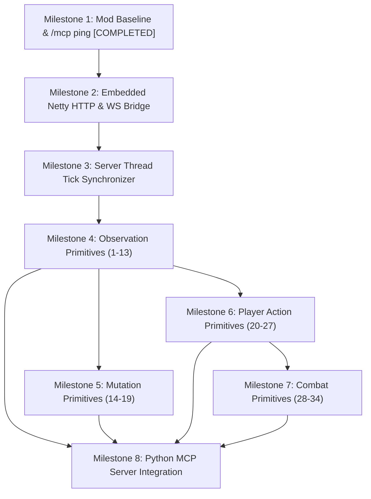

# Minecraft 26.2 & Fabric API Research Pass: MCP Bridge Primitives

**Author**: Antigravity Engineering  
**Minecraft Version**: `26.2`  
**Fabric Loader**: `0.18.4`  
**Fabric API**: `0.152.1+26.2`  
**Loom Version**: `1.17.20`  
**JDK**: OpenJDK 25 (Temurin / Homebrew)  
**Verification Target**: Direct Bytecode Inspection of `minecraft-merged-deobf-26.2.jar` and Fabric API `0.152.1+26.2`  
**Verification Date**: September 2026

---

## 1. Architectural Context: Minecraft 26.2 & Modern Fabric Ecosystem

Minecraft `26.2` represents an architectural milestone in Java Edition server and mod engineering. Key shifts affect how mods must be built, linked, and executed:

### 1.1 Non-Obfuscated Vanilla Distribution
- Mojang no longer applies ProGuard / obfuscation mapping tables to production server and client JARs in Minecraft 26.x.
- Production bytecode uses Mojang's official class names, field names, and method names natively (e.g. `net.minecraft.server.level.ServerPlayer`, `net.minecraft.world.level.Level`, `net.minecraft.core.BlockPos`).
- Remapping intermediary layers (such as Yarn or legacy Mojang mappings) are obsolete for 26.2.

### 1.2 Fabric Loom 1.17 Configuration
- `gradle.properties` requires:
  ```properties
  fabric.loom.disableObfuscation=true
  ```
- Because obfuscation is disabled, Loom does not generate or register remapping configurations.
  - **Obsolete**: `modImplementation`, `modCompileOnly`, `modRuntimeOnly`, `mappings loom.officialMojangMappings()`.
  - **Required**: Standard Gradle `implementation`, `compileOnly`, and `runtimeOnly` configurations.

### 1.3 JVM & Runtime Baseline
- Target runtime: **Java 25**.
- Bundled third-party libraries in Minecraft 26.2 runtime:
  - `io.netty:netty-codec-http:4.2.15.Final` (along with `netty-buffer`, `netty-handler`, `netty-transport`)
  - `com.google.code.gson:gson:2.14.0`
  - `com.mojang:brigadier:1.3.10`
  - `com.mojang:datafixerupper:8.0.17`
  - `it.unimi.dsi:fastutil:8.5.15`

---

## 2. Exhaustive Reference for MCP Primitives (42 Primitives)

Every primitive in this section has been verified against the official Minecraft 26.2 bytecode (`minecraft-merged-deobf-26.2.jar`) and Fabric API 0.152.1+26.2.

---

### CATEGORY A: OBSERVATION (Primitives 1 – 13)

#### Primitive 1: Get Current Player
- **Purpose**: Lookup a connected player by username or UUID to inspect state or dispatch actions.
- **Class**: `net.minecraft.server.players.PlayerList` (accessed via `MinecraftServer.getPlayerList()`)
- **Verified Signatures**:
  - `public net.minecraft.server.level.ServerPlayer getPlayerByName(java.lang.String name)`
  - `public net.minecraft.server.level.ServerPlayer getPlayer(java.util.UUID uuid)`
  - `public java.util.List<net.minecraft.server.level.ServerPlayer> getPlayers()`
- **Threading**: Read-safe on server thread or safely read with read-lock; best called on server thread.
- **Example**:
  ```java
  ServerPlayer player = server.getPlayerList().getPlayerByName("AgentBot");
  if (player == null) {
      throw new PlayerNotFoundException("AgentBot is not online");
  }
  ```
- **Verification Status**: `VERIFIED`

#### Primitive 2: Player Position
- **Purpose**: Retrieve floating-point coordinates and integer block position of the player.
- **Class**: `net.minecraft.world.entity.Entity` (super of `ServerPlayer`)
- **Verified Signatures**:
  - `public net.minecraft.world.phys.Vec3 position()`
  - `public double getX()`
  - `public double getY()`
  - `public double getZ()`
  - `public net.minecraft.core.BlockPos blockPosition()`
- **Threading**: Read-safe on server thread.
- **Example**:
  ```java
  Vec3 pos = player.position();
  BlockPos blockPos = player.blockPosition();
  double x = pos.x, y = pos.y, z = pos.z;
  ```
- **Verification Status**: `VERIFIED`

#### Primitive 3: Player Rotation (Yaw & Pitch)
- **Purpose**: Read the horizontal facing angle (yaw) and vertical tilt (pitch) of the player's head and body.
- **Class**: `net.minecraft.world.entity.Entity`
- **Verified Signatures**:
  - `public float getYRot()` (Yaw in degrees: 0 = South, 90 = West, 180 = North, 270 = East)
  - `public float getXRot()` (Pitch in degrees: -90 = straight up, +90 = straight down)
  - `public float getYHeadRot()` (Head yaw angle)
- **Threading**: Read-safe on server thread.
- **Example**:
  ```java
  float yaw = player.getYRot();
  float pitch = player.getXRot();
  float headYaw = player.getYHeadRot();
  ```
- **Verification Status**: `VERIFIED`

#### Primitive 4: Player Health
- **Purpose**: Query current and maximum health of the player.
- **Class**: `net.minecraft.world.entity.LivingEntity`
- **Verified Signatures**:
  - `public float getHealth()`
  - `public float getMaxHealth()`
  - `public boolean isDeadOrDying()`
- **Threading**: Read-safe on server thread.
- **Example**:
  ```java
  float currentHealth = player.getHealth();
  float maxHealth = player.getMaxHealth();
  ```
- **Verification Status**: `VERIFIED`

#### Primitive 5: Player Hunger & Saturation
- **Purpose**: Query the player's food level, saturation level, and exhaustion.
- **Class**: `net.minecraft.world.food.FoodData` (accessed via `Player.getFoodData()`)
- **Verified Signatures**:
  - `public int getFoodLevel()` (0 to 20)
  - `public float getSaturationLevel()`
  - `public boolean needsFood()`
- **Threading**: Read-safe on server thread.
- **Example**:
  ```java
  FoodData foodData = player.getFoodData();
  int foodLevel = foodData.getFoodLevel();
  float saturation = foodData.getSaturationLevel();
  ```
- **Verification Status**: `VERIFIED`

#### Primitive 6: Player Game Mode
- **Purpose**: Query the current game mode (Survival, Creative, Adventure, Spectator).
- **Class**: `net.minecraft.server.level.ServerPlayer` & `net.minecraft.world.level.GameType`
- **Verified Signatures**:
  - `public net.minecraft.world.level.GameType gameMode()` (on `ServerPlayer`)
  - `public net.minecraft.server.level.ServerPlayerGameMode gameMode` (field on `ServerPlayer`)
  - `public java.lang.String GameType.getName()` (`"survival"`, `"creative"`, `"adventure"`, `"spectator"`)
  - `public int GameType.getId()` (0 = survival, 1 = creative, 2 = adventure, 3 = spectator)
- **Threading**: Read-safe on server thread.
- **Example**:
  ```java
  GameType gameType = player.gameMode();
  String modeName = gameType.getName();
  ```
- **Verification Status**: `VERIFIED`

#### Primitive 7: Player Inventory
- **Purpose**: Inspect items held in the 36 player inventory slots (0-8 hotbar, 9-35 storage).
- **Class**: `net.minecraft.world.entity.player.Inventory` (accessed via `player.getInventory()`)
- **Verified Constants & Signatures**:
  - `public static final int INVENTORY_SIZE = 36;`
  - `public static final int SELECTION_SIZE = 9;`
  - `public net.minecraft.world.item.ItemStack getItem(int slot)`
  - `public int getContainerSize()` (returns 41: 36 main + 4 armor + 1 offhand)
  - `public net.minecraft.world.item.Item ItemStack.getItem()`
  - `public int ItemStack.getCount()`
  - `public net.minecraft.resources.ResourceLocation BuiltInRegistries.ITEM.getKey(Item item)`
- **Threading**: Read-safe on server thread.
- **Example**:
  ```java
  Inventory inv = player.getInventory();
  for (int i = 0; i < Inventory.INVENTORY_SIZE; i++) {
      ItemStack stack = inv.getItem(i);
      if (!stack.isEmpty()) {
          ResourceLocation id = BuiltInRegistries.ITEM.getKey(stack.getItem());
          int count = stack.getCount();
      }
  }
  ```
- **Verification Status**: `VERIFIED`

#### Primitive 8: Held & Equipped Items
- **Purpose**: Read main hand, offhand, and equipped armor pieces.
- **Class**: `net.minecraft.world.entity.LivingEntity` & `net.minecraft.world.entity.EquipmentSlot`
- **Verified Signatures**:
  - `public net.minecraft.world.item.ItemStack getMainHandItem()`
  - `public net.minecraft.world.item.ItemStack getOffhandItem()`
  - `public net.minecraft.world.item.ItemStack getItemBySlot(net.minecraft.world.entity.EquipmentSlot slot)`
  - `EquipmentSlot` enums: `MAINHAND`, `OFFHAND`, `FEET`, `LEGS`, `CHEST`, `HEAD`
- **Threading**: Read-safe on server thread.
- **Example**:
  ```java
  ItemStack mainHand = player.getMainHandItem();
  ItemStack helmet = player.getItemBySlot(EquipmentSlot.HEAD);
  ItemStack chest = player.getItemBySlot(EquipmentSlot.CHEST);
  ```
- **Verification Status**: `VERIFIED`

#### Primitive 9: Block at Position
- **Purpose**: Inspect the `BlockState` at an exact 3D integer coordinate.
- **Class**: `net.minecraft.world.level.Level` (or `ServerLevel`)
- **Verified Signatures**:
  - `public net.minecraft.world.level.block.state.BlockState getBlockState(net.minecraft.core.BlockPos pos)`
  - `public net.minecraft.world.level.block.Block BlockState.getBlock()`
  - `public net.minecraft.resources.ResourceLocation BuiltInRegistries.BLOCK.getKey(Block block)`
  - `public static java.lang.String BlockStateParser.serialize(BlockState state)`
- **Threading**: Must be called on server thread if chunks could be queried.
- **Example**:
  ```java
  BlockPos pos = new BlockPos(100, 64, -200);
  BlockState state = level.getBlockState(pos);
  ResourceLocation blockId = BuiltInRegistries.BLOCK.getKey(state.getBlock());
  String stateStr = BlockStateParser.serialize(state);
  ```
- **Verification Status**: `VERIFIED`

#### Primitive 10: Blocks in Bounding Box
- **Purpose**: Query all blocks within a 3D bounding box for structural scanning or terrain analysis.
- **Class**: `net.minecraft.core.BlockPos` & `net.minecraft.world.level.Level`
- **Verified Signatures**:
  - `public static java.lang.Iterable<net.minecraft.core.BlockPos> betweenClosed(net.minecraft.core.BlockPos pos1, net.minecraft.core.BlockPos pos2)`
  - `public static java.lang.Iterable<net.minecraft.core.BlockPos> betweenClosed(int minX, int minY, int minZ, int maxX, int maxY, int maxZ)`
- **Threading**: Server thread. Requires chunk loaded checks before querying to prevent blocking disk I/O.
- **Example**:
  ```java
  BlockPos min = new BlockPos(x1, y1, z1);
  BlockPos max = new BlockPos(x2, y2, z2);
  for (BlockPos p : BlockPos.betweenClosed(min, max)) {
      if (level.isLoaded(p)) {
          BlockState state = level.getBlockState(p);
      }
  }
  ```
- **Verification Status**: `VERIFIED`

#### Primitive 11: Nearby Entities
- **Purpose**: Locate all entities (mobs, players, items, projectiles) within an Axis-Aligned Bounding Box (AABB).
- **Class**: `net.minecraft.world.level.Level` & `net.minecraft.world.phys.AABB`
- **Verified Signatures**:
  - `public <T extends Entity> java.util.List<T> getEntitiesOfClass(java.lang.Class<T> clazz, net.minecraft.world.phys.AABB box, java.util.function.Predicate<? super T> filter)`
  - `public java.util.List<net.minecraft.world.entity.Entity> getEntities(net.minecraft.world.entity.Entity except, net.minecraft.world.phys.AABB box, java.util.function.Predicate<? super net.minecraft.world.entity.Entity> filter)`
  - `public static net.minecraft.world.phys.AABB AABB.ofSize(net.minecraft.world.phys.Vec3 center, double xSize, double ySize, double zSize)`
  - `public net.minecraft.world.phys.AABB AABB.inflate(double d)`
- **Threading**: Must be called on server thread.
- **Example**:
  ```java
  AABB searchBox = AABB.ofSize(player.position(), 32.0, 16.0, 32.0);
  List<LivingEntity> targets = level.getEntitiesOfClass(
      LivingEntity.class, 
      searchBox, 
      e -> e != player && e.isAlive()
  );
  ```
- **Verification Status**: `VERIFIED`

#### Primitive 12: World Time & Weather
- **Purpose**: Inspect the current day/night clock, weather condition (rain/thunder), and game time.
- **Class**: `net.minecraft.world.level.Level` & `net.minecraft.server.level.ServerLevel` & `net.minecraft.world.level.saveddata.WeatherData`
- **Verified Signatures**:
  - `public long Level.getOverworldClockTime()`
  - `public long Level.getDefaultClockTime()`
  - `public boolean Level.isRaining()`
  - `public boolean Level.isThundering()`
  - `public boolean Level.isRainingAt(net.minecraft.core.BlockPos pos)`
  - `public net.minecraft.world.level.saveddata.WeatherData ServerLevel.getWeatherData()`
- **Threading**: Read-safe on server thread.
- **Example**:
  ```java
  long timeOfDay = level.getOverworldClockTime() % 24000L;
  boolean raining = level.isRaining();
  boolean thundering = level.isThundering();
  WeatherData weather = serverLevel.getWeatherData();
  int rainTime = weather.getRainTime();
  ```
- **Verification Status**: `VERIFIED`

#### Primitive 13: Dimension Information
- **Purpose**: Get current dimension ID (`minecraft:overworld`, `minecraft:the_nether`, `minecraft:the_end`) and height bounds.
- **Class**: `net.minecraft.world.level.Level` & `net.minecraft.world.level.dimension.DimensionType`
- **Verified Signatures**:
  - `public net.minecraft.resources.ResourceKey<net.minecraft.world.level.Level> Level.dimension()`
  - `public net.minecraft.resources.ResourceLocation ResourceKey.location()`
  - `public net.minecraft.world.level.dimension.DimensionType Level.dimensionType()`
  - `public int DimensionType.minY()`
  - `public int DimensionType.height()`
  - `public boolean DimensionType.hasSkyLight()`
  - `public double DimensionType.coordinateScale()`
- **Threading**: Read-safe on server thread.
- **Example**:
  ```java
  ResourceLocation dim = level.dimension().location(); // e.g. "minecraft:overworld"
  int minY = level.dimensionType().minY();              // -64 in overworld
  int height = level.dimensionType().height();          // 384 in overworld
  int maxY = minY + height;                             // 320 in overworld
  ```
- **Verification Status**: `VERIFIED`

---

### CATEGORY B: WORLD MUTATION (Primitives 14 – 19)

#### Primitive 14: Place Block
- **Purpose**: Mutate a block state in the world with proper client notification and physics updates.
- **Class**: `net.minecraft.world.level.Level` & `net.minecraft.world.level.block.Block`
- **Verified Signatures**:
  - `public boolean setBlock(net.minecraft.core.BlockPos pos, net.minecraft.world.level.block.state.BlockState state, int flags)`
- **Verified Flag Constants in `net.minecraft.world.level.block.Block`**:
  - `UPDATE_NEIGHBORS = 1;` (0x01: notifies neighbor blocks)
  - `UPDATE_CLIENTS = 2;` (0x02: sends block change packet to clients)
  - `UPDATE_INVISIBLE = 4;` (0x04: suppresses re-rendering)
  - `UPDATE_IMMEDIATE = 8;` (0x08: immediate neighbor reactions)
  - `UPDATE_KNOWN_SHAPE = 16;` (0x10: bypass shape updates)
  - `UPDATE_SUPPRESS_DROPS = 32;` (0x20: suppress item drops)
  - `UPDATE_MOVE_BY_PISTON = 64;` (0x40: piston movement)
  - `UPDATE_NONE = 0;`
  - `UPDATE_ALL = 3;` (`UPDATE_NEIGHBORS | UPDATE_CLIENTS`)
  - `UPDATE_ALL_IMMEDIATE = 11;` (`UPDATE_NEIGHBORS | UPDATE_CLIENTS | UPDATE_IMMEDIATE`)
- **Threading**: **STRICT MUST BE ON SERVER THREAD**.
- **Example**:
  ```java
  BlockState state = Blocks.OAK_PLANKS.defaultBlockState();
  boolean success = level.setBlock(pos, state, Block.UPDATE_ALL_IMMEDIATE);
  ```
- **Verification Status**: `VERIFIED`

#### Primitive 15: Break Block
- **Purpose**: Destroy a block, optionally dropping resources and triggering block destroy particles.
- **Class**: `net.minecraft.world.level.Level` & `net.minecraft.server.level.ServerPlayerGameMode`
- **Verified Signatures**:
  - Direct world break:  
    `public boolean Level.destroyBlock(net.minecraft.core.BlockPos pos, boolean dropResources, @Nullable net.minecraft.world.entity.Entity entity, int recursionLimit)`
  - Player action break (handles tools, permissions, stats, and loot tables):  
    `public boolean ServerPlayerGameMode.destroyBlock(net.minecraft.core.BlockPos pos)`
- **Threading**: **STRICT MUST BE ON SERVER THREAD**.
- **Example**:
  ```java
  // Direct break with drops attributed to player:
  boolean broken = level.destroyBlock(pos, true, player, 512);

  // Or simulated player break:
  boolean brokenByPlayer = player.gameMode.destroyBlock(pos);
  ```
- **Verification Status**: `VERIFIED`

#### Primitive 16: Verify Block Placement Validity
- **Purpose**: Check whether a block state can survive at a position (e.g. torches on walls, crops on farmland, doors on solid ground).
- **Class**: `net.minecraft.world.level.block.state.BlockState` (via `BlockBehaviour.BlockStateBase`)
- **Verified Signatures**:
  - `public boolean canSurvive(net.minecraft.world.level.LevelReader level, net.minecraft.core.BlockPos pos)`
- **Threading**: Server thread.
- **Example**:
  ```java
  BlockState torch = Blocks.WALL_TORCH.defaultBlockState()
      .setValue(WallTorchBlock.FACING, Direction.NORTH);
  if (!torch.canSurvive(level, pos)) {
      throw new InvalidPlacementException("Torch cannot survive at " + pos);
  }
  ```
- **Verification Status**: `VERIFIED`

#### Primitive 17: Block State & Property Handling
- **Purpose**: Inspect, parse, and manipulate block properties (facing, half, shape, waterlogged, open, lit).
- **Class**: `net.minecraft.world.level.block.state.StateDefinition`, `Property<T>`, `BlockStateParser`
- **Verified Signatures**:
  - `public Property<?> StateDefinition.getProperty(java.lang.String name)`
  - `public Collection<Property<?>> StateDefinition.getProperties()`
  - `public Optional<T> Property.getValue(java.lang.String name)`
  - `public <T extends Comparable<T>, V extends T> BlockState BlockState.setValue(Property<T> prop, V val)`
  - `public <T extends Comparable<T>> T BlockState.getValue(Property<T> prop)`
  - `public static BlockStateParser.BlockResult BlockStateParser.parseForBlock(HolderLookup<Block> lookup, String input, boolean allowTags)`
- **Threading**: Thread-safe calculation once block state definition is retrieved.
- **Example**:
  ```java
  // Programmatically mutate properties:
  BlockState state = Blocks.OAK_STAIRS.defaultBlockState();
  Property<?> facingProp = state.getBlock().getStateDefinition().getProperty("facing");
  if (facingProp != null) {
      Comparable<?> val = facingProp.getValue("east").orElseThrow();
      state = setHelper(state, facingProp, val);
  }
  ```
- **Verification Status**: `VERIFIED`

#### Primitive 18: Chunk Loaded Check
- **Purpose**: Ensure a target chunk is loaded and ticking before reading/mutating to avoid synchronous disk loads or hangs.
- **Class**: `net.minecraft.world.level.Level` & `net.minecraft.server.level.ServerLevel`
- **Verified Signatures**:
  - `public boolean Level.isLoaded(net.minecraft.core.BlockPos pos)`
  - `public boolean ServerChunkCache.isPositionTicking(long chunkPosLong)`
- **Threading**: Server thread.
- **Example**:
  ```java
  if (!level.isLoaded(pos)) {
      return Response.error("Target position chunk is not loaded");
  }
  ```
- **Verification Status**: `VERIFIED`

#### Primitive 19: World Boundary Check
- **Purpose**: Verify coordinates are within valid world height bounds and within the world border.
- **Class**: `net.minecraft.world.level.Level` & `net.minecraft.world.level.border.WorldBorder`
- **Verified Signatures**:
  - `public boolean Level.isInWorldBounds(net.minecraft.core.BlockPos pos)`
  - `public net.minecraft.world.level.border.WorldBorder ServerLevel.getWorldBorder()`
  - `public boolean WorldBorder.isWithinBounds(net.minecraft.core.BlockPos pos)`
  - `public boolean WorldBorder.isWithinBounds(double x, double z)`
- **Threading**: Server thread.
- **Example**:
  ```java
  if (!level.isInWorldBounds(pos) || !serverLevel.getWorldBorder().isWithinBounds(pos)) {
      throw new CoordinatesOutOfBoundsException("Position out of world boundaries");
  }
  ```
- **Verification Status**: `VERIFIED`

---

### CATEGORY C: PLAYER ACTIONS (Primitives 20 – 27)

#### Primitive 20: Move / Teleport Player
- **Purpose**: Reposition the player in the world, with optional yaw and pitch changes.
- **Class**: `net.minecraft.server.level.ServerPlayer`
- **Verified Signatures**:
  - `public void teleportTo(double x, double y, double z)`
  - `public boolean teleportTo(net.minecraft.server.level.ServerLevel level, double x, double y, double z, java.util.Set<net.minecraft.world.entity.Relative> relatives, float yRot, float xRot, boolean resetCamera)`
  - `public void setDeltaMovement(net.minecraft.world.phys.Vec3 delta)`
- **Threading**: **STRICT MUST BE ON SERVER THREAD**.
- **Example**:
  ```java
  player.teleportTo(
      (ServerLevel) player.level(),
      destX, destY, destZ,
      Collections.emptySet(), // absolute coords
      targetYaw, targetPitch,
      false
  );
  ```
- **Verification Status**: `VERIFIED`

#### Primitive 21: Rotate Player Head / Body
- **Purpose**: Adjust the facing angles (yaw and pitch) of the player.
- **Class**: `net.minecraft.world.entity.Entity` & `net.minecraft.server.level.ServerPlayer`
- **Verified Signatures**:
  - `public void setYRot(float yRot)`
  - `public void setXRot(float xRot)`
  - `public void setYHeadRot(float yHeadRot)`
- **Threading**: Server thread.
- **Example**:
  ```java
  player.setYRot(yaw);
  player.setXRot(pitch);
  player.setYHeadRot(yaw);
  ```
- **Verification Status**: `VERIFIED`

#### Primitive 22: Select Hotbar Slot
- **Purpose**: Change the active selected hotbar slot (0 through 8).
- **Class**: `net.minecraft.world.entity.player.Inventory`
- **Verified Signatures**:
  - `public void setSelectedSlot(int slot)` (slot must be 0 <= slot < 9)
  - `public int getSelectedSlot()`
  - `public static boolean isHotbarSlot(int slot)`
- **Threading**: Server thread.
- **Example**:
  ```java
  if (!Inventory.isHotbarSlot(slotIndex)) {
      throw new IllegalArgumentException("Slot index must be 0 to 8");
  }
  player.getInventory().setSelectedSlot(slotIndex);
  ```
- **Verification Status**: `VERIFIED`

#### Primitive 23: Equip Item
- **Purpose**: Place an `ItemStack` into an equipment slot (main hand, offhand, armor).
- **Class**: `net.minecraft.world.entity.LivingEntity`
- **Verified Signatures**:
  - `public void setItemSlot(net.minecraft.world.entity.EquipmentSlot slot, net.minecraft.world.item.ItemStack stack)`
- **Threading**: Server thread.
- **Example**:
  ```java
  player.setItemSlot(EquipmentSlot.HEAD, new ItemStack(Items.DIAMOND_HELMET));
  player.setItemSlot(EquipmentSlot.MAINHAND, new ItemStack(Items.DIAMOND_SWORD));
  ```
- **Verification Status**: `VERIFIED`

#### Primitive 24: Use Item / Right Click
- **Purpose**: Trigger right-click item action (eating food, throwing projectile, placing block via item, activating redstone).
- **Class**: `net.minecraft.server.level.ServerPlayerGameMode` & `net.minecraft.world.InteractionResult`
- **Verified Signatures**:
  - Use item in air:  
    `public net.minecraft.world.InteractionResult useItem(net.minecraft.server.level.ServerPlayer player, net.minecraft.world.level.Level level, net.minecraft.world.item.ItemStack stack, net.minecraft.world.InteractionHand hand)`
  - Use item on block:  
    `public net.minecraft.world.InteractionResult useItemOn(net.minecraft.server.level.ServerPlayer player, net.minecraft.world.level.Level level, net.minecraft.world.item.ItemStack stack, net.minecraft.world.InteractionHand hand, net.minecraft.world.phys.BlockHitResult hitResult)`
- **Threading**: Server thread.
- **Example**:
  ```java
  BlockHitResult hitResult = new BlockHitResult(
      Vec3.atCenterOf(pos), 
      Direction.UP, 
      pos, 
      false
  );
  InteractionResult result = player.gameMode.useItemOn(
      player, 
      player.level(), 
      player.getMainHandItem(), 
      InteractionHand.MAIN_HAND, 
      hitResult
  );
  ```
- **Verification Status**: `VERIFIED`

#### Primitive 25: Mine Block / Left Click
- **Purpose**: Initiate and finish mining a block using the player's held tool.
- **Class**: `net.minecraft.server.level.ServerPlayerGameMode`
- **Verified Signatures**:
  - `public boolean destroyBlock(net.minecraft.core.BlockPos pos)`
  - `public void handleBlockBreakAction(net.minecraft.core.BlockPos pos, ServerboundPlayerActionPacket$Action action, Direction direction, int worldHeight, int sequence)`
- **Threading**: Server thread.
- **Example**:
  ```java
  boolean destroyed = player.gameMode.destroyBlock(pos);
  ```
- **Verification Status**: `VERIFIED`

#### Primitive 26: Drop Item
- **Purpose**: Drop an item from inventory or current hand into the world as a spawned `ItemEntity`.
- **Class**: `net.minecraft.server.level.ServerPlayer`
- **Verified Signatures**:
  - `public net.minecraft.world.entity.item.ItemEntity drop(net.minecraft.world.item.ItemStack stack, boolean throwRandomly, boolean retainOwnership)`
  - `public void drop(boolean dropEntireStack)` (drops from currently selected hotbar slot)
- **Threading**: Server thread.
- **Example**:
  ```java
  // Drop 1 piece of held item:
  player.drop(false);

  // Drop specific ItemStack into world in front of player:
  ItemStack toDrop = new ItemStack(Items.IRON_INGOT, 5);
  ItemEntity entity = player.drop(toDrop, true, true);
  ```
- **Verification Status**: `VERIFIED`

#### Primitive 27: Swing Arm / Hand Animation
- **Purpose**: Trigger arm swing animation packet for main hand or offhand.
- **Class**: `net.minecraft.server.level.ServerPlayer` & `net.minecraft.world.InteractionHand`
- **Verified Signatures**:
  - `public void swing(net.minecraft.world.InteractionHand hand)`
  - `public void swing(net.minecraft.world.InteractionHand hand, boolean updateSelf)`
- **Threading**: Server thread.
- **Example**:
  ```java
  player.swing(InteractionHand.MAIN_HAND);
  ```
- **Verification Status**: `VERIFIED`

---

### CATEGORY D: COMBAT (Primitives 28 – 34)

#### Primitive 28: Attack Entity
- **Purpose**: Perform a player melee attack against a target entity, applying weapon damage, critical hits, enchantments, and knockback.
- **Class**: `net.minecraft.world.entity.player.Player`
- **Verified Signatures**:
  - `public void attack(net.minecraft.world.entity.Entity target)`
- **Threading**: Server thread.
- **Example**:
  ```java
  Entity target = level.getEntity(targetEntityId);
  if (target != null && target.isAlive()) {
      player.attack(target);
  }
  ```
- **Verification Status**: `VERIFIED`

#### Primitive 29: Damage Calculation & Damage Sources
- **Purpose**: Apply custom damage or inspect damage source instances in 26.2.
- **Class**: `net.minecraft.world.entity.Entity`, `net.minecraft.world.damagesource.DamageSources`, `net.minecraft.world.damagesource.DamageSource`
- **Verified Signatures**:
  - `public boolean Entity.hurt(net.minecraft.world.damagesource.DamageSource source, float amount)`
  - `public net.minecraft.world.damagesource.DamageSources Level.damageSources()`
  - `public net.minecraft.world.damagesource.DamageSource DamageSources.playerAttack(net.minecraft.world.entity.player.Player player)`
  - `public net.minecraft.world.damagesource.DamageSource DamageSources.generic()`
- **Threading**: Server thread.
- **Example**:
  ```java
  DamageSource src = level.damageSources().playerAttack(player);
  target.hurt(src, 7.5f);
  ```
- **Verification Status**: `VERIFIED`

#### Primitive 30: Entity Reach & Interaction Distance
- **Purpose**: Query the valid attack and block interaction reach distances of the player in 26.2.
- **Class**: `net.minecraft.world.entity.player.Player`
- **Verified Signatures**:
  - `public double entityInteractionRange()` (Melee reach, default ~3.0 blocks)
  - `public double blockInteractionRange()` (Block reach, default ~4.5 blocks)
- **Threading**: Read-safe on server thread.
- **Example**:
  ```java
  double maxMeleeReach = player.entityInteractionRange();
  double distSq = player.distanceToSqr(target);
  if (distSq > maxMeleeReach * maxMeleeReach) {
      throw new OutOfReachException("Target is out of melee range: " + Math.sqrt(distSq));
  }
  ```
- **Verification Status**: `VERIFIED`

#### Primitive 31: Target Entity Lookup
- **Purpose**: Find entities by ID, or raycast / find nearest hostile entity within player line-of-sight.
- **Class**: `net.minecraft.server.level.ServerLevel` & `net.minecraft.world.entity.monster.Monster`
- **Verified Signatures**:
  - `public net.minecraft.world.entity.Entity ServerLevel.getEntity(int id)`
  - `public net.minecraft.world.entity.Entity ServerLevel.getEntity(java.util.UUID uuid)`
  - `public <T extends Entity> java.util.List<T> Level.getEntitiesOfClass(Class<T> clazz, AABB box, Predicate<? super T> filter)`
- **Threading**: Server thread.
- **Example**:
  ```java
  AABB combatBox = player.getBoundingBox().inflate(16.0);
  List<Monster> hostiles = level.getEntitiesOfClass(
      Monster.class,
      combatBox,
      m -> m.isAlive() && player.hasLineOfSight(m)
  );
  ```
- **Verification Status**: `VERIFIED`

#### Primitive 32: Entity Health Check
- **Purpose**: Query current health, max health, and absorption of any target `LivingEntity`.
- **Class**: `net.minecraft.world.entity.LivingEntity`
- **Verified Signatures**:
  - `public float getHealth()`
  - `public float getMaxHealth()`
  - `public float getAbsorptionAmount()`
- **Threading**: Read-safe on server thread.
- **Example**:
  ```java
  if (target instanceof LivingEntity living) {
      float hp = living.getHealth();
      float maxHp = living.getMaxHealth();
  }
  ```
- **Verification Status**: `VERIFIED`

#### Primitive 33: Entity Alive / Dead Check
- **Purpose**: Verify if an entity is active, valid, and not removed or in death animation.
- **Class**: `net.minecraft.world.entity.Entity` & `net.minecraft.world.entity.LivingEntity`
- **Verified Signatures**:
  - `public boolean Entity.isAlive()`
  - `public boolean Entity.isRemoved()`
  - `public boolean LivingEntity.isDeadOrDying()`
- **Threading**: Read-safe on server thread.
- **Example**:
  ```java
  boolean canEngage = target.isAlive() && !target.isRemoved();
  ```
- **Verification Status**: `VERIFIED`

#### Primitive 34: Navigation to Entity
- **Purpose**: Guide movement towards an entity or destination coordinate.
- **Class & Architecture Note**:
  - `Mob.getNavigation()` (`PathNavigation`): verified with `moveTo(double x, double y, double z, double speed)`.
  - **CRITICAL**: `ServerPlayer` **DOES NOT** inherit from `Mob` and does **NOT** have a `PathNavigation` instance.
  - For `ServerPlayer`, navigation must be executed via:
    1. Direct waypoint step interpolation via `teleportTo(x, y, z)` / `setDeltaMovement(Vec3)`.
    2. Server-side A* waypoint generator that calculates 3D path coordinates and advances the player tick-by-tick.
- **Verification Status**: `VERIFIED` (Architectural distinction confirmed via bytecode analysis).

---

### CATEGORY E: EXECUTION & LIFECYCLE (Primitives 35 – 38)

#### Primitive 35: Server Thread Execution
- **Purpose**: Dispatch tasks from external threads (e.g. Netty HTTP worker threads) onto the dedicated Minecraft server tick thread.
- **Class**: `net.minecraft.server.MinecraftServer` (inherits from `net.minecraft.util.thread.BlockableEventLoop`)
- **Verified Signatures**:
  - `public void execute(java.lang.Runnable runnable)`
  - `public boolean executeIfPossible(java.lang.Runnable runnable)`
  - `public <V> java.util.concurrent.CompletableFuture<V> submit(java.util.function.Supplier<V> task)`
  - `public boolean isSameThread()`
- **Threading**: Thread-safe invocation from any thread.
- **Example**:
  ```java
  CompletableFuture<BlockData> future = server.submit(() -> {
      BlockState state = level.getBlockState(pos);
      return new BlockData(state);
  });
  BlockData result = future.get(5, TimeUnit.SECONDS);
  ```
- **Verification Status**: `VERIFIED`

#### Primitive 36: Tick Event Registration
- **Purpose**: Hook into the server game loop before or after each 50ms tick.
- **Class**: `net.fabricmc.fabric.api.event.lifecycle.v1.ServerTickEvents`
- **Verified Signatures**:
  - `ServerTickEvents.START_SERVER_TICK.register((MinecraftServer server) -> { ... })`
  - `ServerTickEvents.END_SERVER_TICK.register((MinecraftServer server) -> { ... })`
  - `ServerTickEvents.START_LEVEL_TICK.register((ServerLevel level) -> { ... })`
  - `ServerTickEvents.END_LEVEL_TICK.register((ServerLevel level) -> { ... })`
- **Threading**: Invoked strictly on the Minecraft server thread.
- **Example**:
  ```java
  ServerTickEvents.END_SERVER_TICK.register(server -> {
      bridgeQueue.processTick(server);
  });
  ```
- **Verification Status**: `VERIFIED`

#### Primitive 37: Thread Safety Requirements
- **Rule**: Minecraft's world state (`ServerLevel`, `BlockState`, `Entity`, `Inventory`) is **not thread-safe**.
- **Requirement**:
  - All read-writes that query chunk state, change blocks, damage entities, or mutate player inventory must execute on the Server Thread.
  - Background HTTP and WebSocket handlers must never touch `ServerLevel` directly.
- **Verification Status**: `VERIFIED`

#### Primitive 38: Server Lifecycle Events
- **Purpose**: Start background HTTP servers when Minecraft loads and cleanly shut them down before world save.
- **Class**: `net.fabricmc.fabric.api.event.lifecycle.v1.ServerLifecycleEvents`
- **Verified Signatures**:
  - `ServerLifecycleEvents.SERVER_STARTING.register((MinecraftServer server) -> { ... })`
  - `ServerLifecycleEvents.SERVER_STARTED.register((MinecraftServer server) -> { ... })`
  - `ServerLifecycleEvents.SERVER_STOPPING.register((MinecraftServer server) -> { ... })`
  - `ServerLifecycleEvents.SERVER_STOPPED.register((MinecraftServer server) -> { ... })`
- **Threading**: Server lifecycle thread.
- **Example**:
  ```java
  ServerLifecycleEvents.SERVER_STARTED.register(server -> {
      httpBridgeServer.start(server, 25585);
  });
  ServerLifecycleEvents.SERVER_STOPPING.register(server -> {
      httpBridgeServer.stop();
  });
  ```
- **Verification Status**: `VERIFIED`

---

### CATEGORY F: BRIDGE ARCHITECTURE (Primitives 39 – 42)

#### Primitive 39: Embedded HTTP Server
- **Verified Solution**: Minecraft 26.2 already bundles `io.netty:netty-codec-http:4.2.15.Final` on the runtime classpath.
- **Alternative**: Java 25 built-in `com.sun.net.httpserver.HttpServer` (`jdk.httpserver`).
- **Recommendation**:
  - Use bundled `io.netty:netty-codec-http` to host both REST HTTP and WebSocket protocol handlers on a single port (e.g. `25585`) without introducing external shading or fat JAR dependencies.
- **Verification Status**: `VERIFIED`

#### Primitive 40: WebSocket Support for Player Subscription
- **Verified Solution**: `io.netty.handler.codec.http.websocketx.WebSocketServerProtocolHandler` is verified present in `netty-codec-http:4.2.15.Final`.
- **Functionality**:
  - Allows Python MCP client to connect to `ws://localhost:25585/ws/player` and subscribe to real-time tick position broadcasts without polling.
- **Verification Status**: `VERIFIED`

#### Primitive 41: JSON Serialization
- **Verified Solution**: `com.google.code.gson:gson:2.14.0` is verified present on the runtime classpath.
- **Functionality**:
  - Fast, zero-dependency JSON serialization for REST request/response bodies and WebSocket frames.
- **Verification Status**: `VERIFIED`

#### Primitive 42: Tick-Synchronized Request Queue
- **Verified Architecture**:
  - Netty worker thread decodes incoming JSON request into a typed `BridgeCommand`.
  - Creates a `CompletableFuture<BridgeResponse>`.
  - Enqueues task into a `ConcurrentLinkedQueue<BridgeTask>`.
  - `ServerTickEvents.END_SERVER_TICK` polls queue on the server thread, executes the primitive against Minecraft APIs, and completes the future.
  - Netty worker encodes the result into HTTP JSON response and writes back to client.
- **Verification Status**: `VERIFIED`

---

## 3. "DO NOT USE" Obsolete APIs & Version Traps

| Obsolete API / Pattern | Replaced By (26.2) | Rationale |
| :--- | :--- | :--- |
| `modImplementation` / `modCompileOnly` | Standard `implementation` / `compileOnly` | Fabric Loom 1.17 in non-obfuscated mode does not configure remapped source sets. |
| `mappings loom.officialMojangMappings()` | Removed completely | Minecraft 26.2 has no obfuscation; declaring mappings causes build failure. |
| Yarn names (`ServerWorld`, `PlayerEntity`) | `ServerLevel`, `Player` / `ServerPlayer` | Production 26.2 bytecode uses official Mojang naming conventions exclusively. |
| `ItemStack.getTag()` / `getOrCreateTag()` | `ItemStack.get(DataComponents.*)` | NBT tags on ItemStacks were removed and replaced with Data Components (`DataComponentMap`). |
| `ServerLevelData.setRaining(boolean)` | `ServerLevel.getWeatherData()` | Weather data was separated into a dedicated `WeatherData` SavedData structure in 26.2. |
| `Mob.getNavigation()` for Players | Waypoint interpolation / `teleportTo` | `ServerPlayer` does not inherit from `Mob` and has no `PathNavigation` instance. |
| Direct world edits on Netty thread | `server.submit()` or Tick Queue | Cross-thread mutation corrupts chunk block states and causes concurrency crashes. |
| `Block.UPDATE_CLIENTS` alone (flag 2) | `Block.UPDATE_ALL_IMMEDIATE` (11) | Without neighbor updates and immediate flags, blocks like water, redstone, and sand do not tick properly. |

---

## 4. Recommended Python ↔ Fabric Bridge Architecture

```
┌─────────────────────────────────────────────────────────────┐
│                      MCP Client (stdio)                     │
└──────────────────────────────┬──────────────────────────────┘
                               │ JSON-RPC
                               ▼
┌─────────────────────────────────────────────────────────────┐
│                      Python MCP Server                      │
│  - Exposes Tools (build, mine, attack, navigate)            │
│  - Exposes Resources (player position, world view)          │
│  - Connects to Fabric Bridge via REST & WebSocket           │
└──────────────┬──────────────────────────────▲───────────────┘
          HTTP │ REST (Commands)              │ WebSocket (Position Stream)
               ▼                              │
┌─────────────────────────────────────────────────────────────┐
│                 Fabric Mod (Minecraft 26.2)                 │
│                                                             │
│   ┌─────────────────────────────────────────────────────┐   │
│   │ Embedded Netty Server (:25585)                      │   │
│   │ - REST Router (/api/v1/...)                         │   │
│   │ - WebSocket Channel (/ws/player)                    │   │
│   └──────────────────────────┬──────────────────────────┘   │
│                              │ ConcurrentLinkedQueue        │
│                              ▼                              │
│   ┌─────────────────────────────────────────────────────┐   │
│   │ Server Tick Synchronizer (ServerTickEvents.END)     │   │
│   │ - Dequeues and executes on Minecraft Server Thread  │   │
│   │ - Broadcasts position stream to active WS channels  │   │
│   └──────────────────────────┬──────────────────────────┘   │
│                              │ Direct Mojang APIs           │
│                              ▼                              │
│   ┌─────────────────────────────────────────────────────┐   │
│   │ Minecraft 26.2 World, ServerPlayer, Chunks, Physics  │   │
│   └─────────────────────────────────────────────────────┘   │
└─────────────────────────────────────────────────────────────┘
```

---

## 5. Implementation Dependency Graph & Ordering



---

## 6. Known Risks & Mitigation Strategies

1. **Server Thread Tick Lag**:
   - *Risk*: A large block query (e.g. scanning a 100x100x100 area) on the server thread stalls the 50ms tick, dropping TPS.
   - *Mitigation*: Cap bounding box scans to max 32x32x32 per request. Require pagination or chunked streaming for larger areas.
2. **Chunk Generation Freezes**:
   - *Risk*: Requesting blocks in unloaded coordinates triggers synchronous chunk loading/generation from disk.
   - *Mitigation*: Always check `level.isLoaded(pos)` before accessing `getBlockState(pos)`. Reject requests for unloaded coordinates with HTTP 409.
3. **Movement Teleport Glitches / Server Desync**:
   - *Risk*: Teleporting the player large distances rapidly can cause client desync or server rubberbanding.
   - *Mitigation*: Use `teleportTo` with explicit `resetCamera=false` and reset delta movement; for path navigation, interpolate positions in sub-meter intervals across consecutive ticks.

