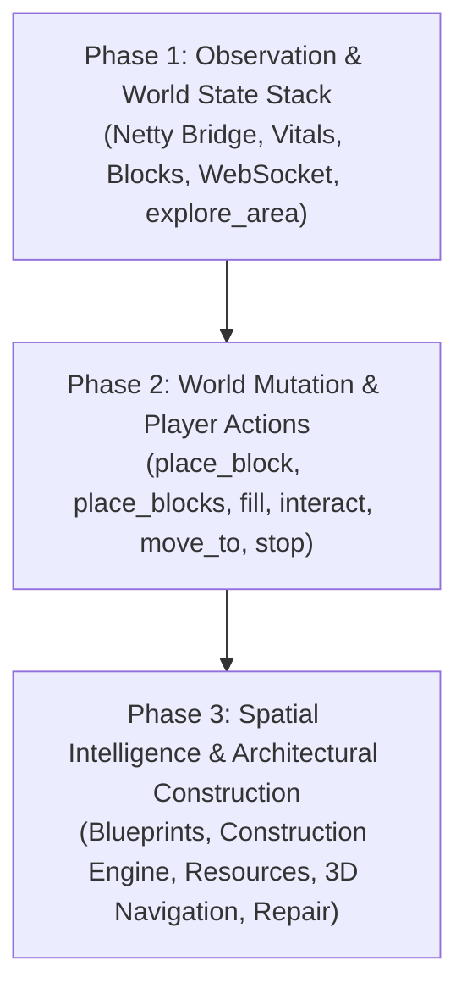

# Minecraft MCP — Implementation Rules & Engineering Specification

This document codifies the **30 Non-Negotiable Implementation Rules** for building the **Minecraft Java Edition MCP Server**. All contributors, automated agents, and subagents working on this codebase **must strictly abide by these rules**.

For detailed architecture and tool documentation, see the [Documentation Index](docs/README.md).

---

## 1. Mission & Core Philosophy

The goal is to build an advanced Minecraft Java Edition MCP Server allowing an LLM to:
1. **Observe** the Minecraft world with compact, token-efficient representations.
2. **Navigate** through terrain safely and autonomously.
3. **Build** intricate structures (such as houses) via structured blueprints and batch operations.
4. **Inspect** player state, inventory, and material availability.
5. **Interact** with living entities and mobs.
6. **Plan & Compile** generic architectural structures via structured blueprints (houses, towers, bridges, walls, castles, farms, temples, custom).
7. **Verify & Repair** structures comparing planned vs. actual ground-truth world state.

> [!IMPORTANT]
> **The MCP server is an agent capability layer, NOT merely a wrapper around Minecraft commands.**
> Expose semantic capabilities via a dedicated **server-side Fabric mod bridge**, NOT raw Brigadier commands (`/setblock`, `/fill`, `/kill`) or slow RCON transports.

---

## 2. Rule 1: Never Invent Minecraft APIs (Zero-Guessing Policy)

Do **NOT** guess:
- Minecraft Java APIs or internal class/method names
- Fabric APIs or Yarn / Mojang mappings
- Network packet formats
- Entity or block data properties (`[facing=...]`, `half=...`)
- Version-specific Brigadier command syntax
- Server responses or error formats

### Pre-Implementation Verification Protocol
Before writing any version-specific Minecraft or bridge code:
1. **Target Runtime**: **Minecraft Java 26.2** running on the **Fabric Server Launcher**.
2. **Determine the Fabric Loader and Fabric API versions**.
3. **Consult official documentation**: FabricMC Wiki, Fabric API Javadoc, and Minecraft Wiki.
4. **Inspect actual project dependencies / mappings**.
5. **Verify the API exists** in that exact version.
6. **Compile or execute a smoke test** before assuming it works.
7. **If an API cannot be verified, mark it as `UNRESOLVED`** and seek clarification or use a verified alternative.

---

## 3. Strict 6-Tier Architecture Separation

Implementation code must strictly adhere to the following layer hierarchy:

```
┌─────────────────────────────────────────────────────────────┐
│             Layer 6: High-Level Agent Operations            │
│  (build_structure, build_wall, build_roof, repair_structure)│
└──────────────────────────────┬──────────────────────────────┘
                               │ Calls high-level tools & primitives
                               ▼
┌─────────────────────────────────────────────────────────────┐
│                 Layer 5: MCP Tool Layer                     │
│         (FastMCP / MCP Python SDK v2, stdio server)         │
│         • Schema validation • Error formatting • Stderr logs│
└──────────────────────────────┬──────────────────────────────┘
                               │ Invokes Python Client
                               ▼
┌─────────────────────────────────────────────────────────────┐
│             Layer 4: Python Minecraft Client                │
│    (State models, spatial queries, blueprint compiler, A*)  │
└──────────────────────────────┬──────────────────────────────┘
                               │ Sends HTTP REST & WebSocket frames
                               ▼
┌─────────────────────────────────────────────────────────────┐
│         Layer 3: Transport Bridge (Localhost HTTP/WS)       │
│      (http://127.0.0.1:25585 & ws://.../api/v1/ws/player)  │
└──────────────────────────────┬──────────────────────────────┘
                               │ Dispatches requests to mod endpoints
                               ▼
┌─────────────────────────────────────────────────────────────┐
│      Layer 2: Fabric Server-Side Mod (minecraft-mcp-bridge) │
│       (Embedded Netty server inside Fabric Server tick)     │
└──────────────────────────────┬──────────────────────────────┘
                               │ Executes inside server tick loop
                               ▼
┌─────────────────────────────────────────────────────────────┐
│                 Layer 1: Minecraft Engine                   │
│        (Minecraft Java 26.2 Dedicated Server on Fabric)     │
└─────────────────────────────────────────────────────────────┘
```

### Architectural Boundaries
- **No mixing**: Do not write Minecraft Java logic or raw HTTP handling directly in MCP tool handlers (`Layer 5`).
- **Isolation**: MCP tool handlers only validate inputs, call Layer 4 (`Python Minecraft Client`), and format results into standard MCP responses.
- **Independence**: Layer 4 must be fully testable with pure Python unit tests and mocked HTTP/WS endpoints without running a live Minecraft server.

---

## 4. MCP Layer Standards (SDK v2 & stdio Transport)

1. **Official SDK**: Use the official MCP Python SDK v2 (`mcp`).
2. **Transport**: Run in standard input/output (`stdio`) mode for initial deployment.
3. **Standard Out Rule**:
   - `sys.stdout` is **strictly reserved** for JSON-RPC 2.0 protocol traffic.
   - **NEVER** write `print()`, debug messages, or arbitrary text to `stdout`.
4. **Logging**:
   - All logging must go to `sys.stderr` using structured logging (`structlog` or `logging.StreamHandler(sys.stderr)`).
   - Log fields must include: `tool`, `request_id`, `action`, `target`, `duration_ms`, `result`, `error`.
   - **Never log secrets**.
5. **Schema Validation**: All tool arguments and return values must be validated via Pydantic v2 schemas.

---

## 5. Bottom-Up Implementation Phasing

Development **must** proceed strictly in sequence. No phase may be started until the previous phase has passing unit tests and live verification.



### Phase Details

#### Phase 1: Observation & World State Stack (Completed & Verified)
- Embedded Netty server (:25585), thread-safe tick dispatch via `TickSchedulerService`.
- Tools: `get_server_status`, `get_player_state`, `switch_game_mode`, `get_player_position`, `get_inventory`, `get_block`, `inspect_area`, `get_nearby_entities`, `get_world_info`.
- Dynamic resources: `minecraft://player/position`, `minecraft://player/inventory`, `minecraft://world`, `minecraft://entities/nearby`.
- Prompt: `explore_area`.
- Verified passing 20/20 tests in `scripts/test_phase1_client.py`.

#### Phase 2: World Mutation, Player Actions & Direct Building (Completed & Verified)
- Closed-loop OBSERVE $\rightarrow$ ACT $\rightarrow$ VERIFY pattern returning typed `StructuredActionResult`.
- Tools: `place_block`, `place_blocks`, `break_block`, `fill_region`, `interact_with_block`, `move_to`, `stop_movement`, `teleport`, `look_at`, `select_slot`, `use_item`, `drop_item`, `swing_arm`.
- Dynamic resource: `minecraft://action/state`.
- Verified passing 12/12 tests in `scripts/test_phase2_client.py`.

#### Phase 3: Spatial Intelligence, Architectural Planning & Autonomous Construction
- Spatial World Model (`minecraft://world/map`), flatness analysis (`find_build_location`), landmarks (`mark_location`, `get_landmarks`).
- Generic blueprint compiler (`build_structure`) supporting towers, bridges, walls, houses, castles, farms, temples, custom.
- Semantic components: `build_wall`, `build_roof`, `build_foundation`, `build_pillar`, `build_room`.
- Resource Manager: bill-of-materials, deficit calculation, crafting recovery, `WAITING_FOR_RESOURCES`.
- 3D A* navigation: voxel walkability, steps, drops, dynamic obstacle avoidance (`navigate_to`).
- Closed-loop verification & repair: ground-truth inspection and restoration (`repair_structure`).
- Event aggregator and dynamic plan resource (`minecraft://agent/plan`, `minecraft://construction/current`).

---

## 6. Vertical-Slice Rule (Rule 27)

> [!CAUTION]
> **Do not implement 20 tools and then begin testing.**
> Implement one complete vertical slice from top to bottom before beginning the next.

### Vertical Slice 1: `get_player_state`
Every layer must be implemented, tested, and verified:
1. **MCP Schema**: Pydantic input/output schemas in Layer 5.
2. **MCP Handler**: Tool registration in `FastMCP`.
3. **Client Bridge**: Python query logic in Layer 4 (`GET http://127.0.0.1:8080/api/player/Steve`).
4. **Transport**: Localhost HTTP client (`httpx`) in Layer 3.
5. **Fabric Mod**: Endpoint handler querying `ServerPlayerEntity` in Layer 2.
6. **In-Process MCP Test**: Test using in-process MCP Client (`ClientSession`).
7. **Live Minecraft Smoke Test**: Execute against live Fabric server launcher with verified player.

Only after Vertical Slice 1 is 100% green should the next primitive be built.

---

## 7. Bounded Observation & Token Efficiency (Rules 8 & 9)

- `inspect_area()` **must enforce strict limits**:
  - `DEFAULT_RADIUS = 8`
  - `MAX_RADIUS = 16`
  - `MAX_BLOCKS_RETURNED = 1000`
- Raw voxel coordinate dumps are prohibited for large volumes.
- Supported compact representations:
  1. `"summary"`: Statistical digest (flatness score, min/max Y, slope, material histogram).
  2. `"ascii"`: 2D horizontal layer slices (`. = air`, `G = grass`, `S = stone`).
  3. `"sparse"`: Deviations and obstacles only.

---

## 8. Construction Plans & Pre-Execution Validation (Rules 10, 11, 12, 18)

1. **Explicit Plan Representation**: Construction plans must be pure data structures:
   ```json
   {
     "origin": [100, 64, 200],
     "dimensions": {"width": 9, "depth": 7, "height": 5},
     "blocks": [
       {"x": 100, "y": 64, "z": 200, "block": "minecraft:cobblestone"}
     ]
   }
   ```
2. **Pre-Execution Validation Checklist**:
   A plan must pass validation **before a single block is placed**:
   - [ ] All block identifiers are valid Minecraft namespace IDs.
   - [ ] Coordinates lie within world boundaries and configured build zones.
   - [ ] Total block count $\le \text{MAX\_BLOCKS\_PER\_OPERATION}$ (default 500).
   - [ ] Material check: `get_inventory()` contains sufficient blocks.
   - [ ] No protected / forbidden zone overlaps.
   - [ ] No dangerous block collisions (e.g. lava pockets).
   - [ ] Duplicate coordinate placements resolved.
3. **Atomic or Reversible**: If validation fails, abort completely with `INSUFFICIENT_MATERIALS` or `PLAN_VALIDATION_FAILED`. Never partially build an invalid structure.

---

## 9. Navigation & Combat Contract (Rules 14, 15, 16, 17)

### Navigation
- The LLM decides **WHERE** to go. The navigation subsystem decides **HOW** to get there.
- Never make the LLM micromanage WASD keys or game ticks.
- `move_to()` must report reality:
  ```json
  {
    "status": "success",
    "final_position": [105.2, 64.0, 198.4],
    "distance_travelled": 24.5,
    "path_length": 28
  }
  ```
- If blocked, return `"status": "blocked"` with details. Never pretend movement succeeded.

### Architectural Construction & Verification
- The LLM decides **WHAT** to build and selects/generates the blueprint.
- The Architectural Planner compiles blueprints into sequenced, deterministic construction steps.
- The Resource Manager verifies inventory availability and plans crafting recovery before mutating blocks.
- Agent loop:
  $$\text{Observe} \longrightarrow \text{Blueprint} \longrightarrow \text{Resource Check} \longrightarrow \text{Act (Batch Layers)} \longrightarrow \text{Verify} \longrightarrow \text{Repair / Complete}$$
- **Do not assume a structure is complete without ground-truth verification.**
- Enforce batch safety limit: $\le 500$ blocks per call.

---

## 10. Code-Enforced Safety Boundaries (Rule 24)

These limits must be hard-coded in Python configuration models:

| Boundary | Default Limit | Maximum Limit | Config Key |
| :--- | :---: | :---: | :--- |
| Max Blocks per Operation | 500 blocks | 2,000 blocks | `MAX_BLOCKS_PER_BATCH` |
| Max Area Radius | 8 blocks | 16 blocks | `MAX_INSPECT_RADIUS` |
| Max Navigation Distance | 64 blocks | 128 blocks | `MAX_NAVIGATE_DISTANCE` |
| HTTP Execution Timeout | 5.0 seconds | 15.0 seconds | `COMMAND_TIMEOUT_SEC` |
| Navigation Timeout | 30.0 seconds | 60.0 seconds | `NAV_TIMEOUT_SEC` |
| Allowed Dimensions | overworld | all | `ALLOWED_DIMENSIONS` |

---

## 11. Structured Error Catalog (Rule 21)

Every tool must return structured, actionable errors. Never raise unhandled exceptions to the MCP client.

| Error Code | Trigger Condition | Actionable Remediation Tip |
| :--- | :--- | :--- |
| `NOT_CONNECTED` | Fabric bridge HTTP/WS connection lost | "Verify Fabric server launcher is running on port 25585." |
| `PLAYER_NOT_FOUND` | Tracked player not in world | "Check player list using get_server_status()." |
| `INVALID_POSITION` | Coordinates out of bounds / void | "Ensure Y coordinate is within -64 to 320." |
| `BLOCK_NOT_FOUND` | Unknown block namespace ID | "Consult minecraft://knowledge/blocks for valid IDs." |
| `INSUFFICIENT_MATERIALS` | Inventory lacks required blocks | "Gather missing materials listed in error details." |
| `AREA_TOO_LARGE` | Requested radius > MAX_RADIUS | "Reduce radius to 16 blocks or fewer." |
| `INVALID_BLUEPRINT` | Blueprint definition malformed | "Verify blueprint components, dimensions, and materials." |
| `PATH_NOT_FOUND` | Obstacle blocking all paths | "Inspect obstacle or clear path using break_blocks()." |
| `ACTION_TIMEOUT` | Operation exceeded time budget | "Retry with shorter distance or smaller batch." |
| `ACTION_REJECTED` | Safety boundary / protected zone | "Target location is protected or forbidden." |

---

## 12. Idempotency, Retries, and Timeouts (Rules 22 & 23)

- **Read / Inspection Operations** (`inspect_area`, `get_player_state`, `get_inventory`): **Safe to retry**.
- **Mutating Operations** (`place_blocks`, `break_blocks`, `build_structure`): **Do NOT blindly retry**.
  - Must check world state first before repeating.
- **Strict Timeouts**: Every HTTP REST and WebSocket call must use an explicit client timeout (`timeout=5.0`). No thread may hang indefinitely.

---

## 13. Testing Framework (Rule 26)

The project requires 4 distinct test tiers:

```
┌─────────────────────────────────────────────────────────────┐
│ 1. Unit Tests (pytest / unittest)                           │
│    • Schema validation, blueprint compilation, A* algorithm │
├─────────────────────────────────────────────────────────────┤
│ 2. MCP In-Process Tests (stdio ClientSession)               │
│    • Client connects over stdio pipe, calls tools           │
├─────────────────────────────────────────────────────────────┤
│ 3. Fabric Bridge Tests (HTTP/WebSocket Client)              │
│    • Tests HTTP payload generation and JSON response parsing│
├─────────────────────────────────────────────────────────────┤
│ 4. Live Minecraft Smoke Tests (Fabric Server Launcher)      │
│    • End-to-end verification against localhost:25585 (MC 26)│
└─────────────────────────────────────────────────────────────┘
```

---

## 14. Documentation vs API Reality (Rule 28)

- Documents in `docs/tools/` describe **DESIRED behavior**.
- They do **NOT** prove that a Minecraft command or API exists.
- If live Minecraft behavior differs from documentation:
  1. Determine the exact Fabric mod / Minecraft behavior.
  2. Adjust implementation to match reality.
  3. Update documentation to reflect verified behavior.
  4. **Never silently invent behavior.**

---

## 15. Definition of Done for V1 (Rule 30 Checklist)

V1 is complete when an LLM connected over `stdio` can reliably execute:

- [ ] **1. Connect**: Connect via MCP `stdio` transport and pass `get_server_status()`.
- [ ] **2. Inspect Player**: Read `get_player_state()` and receive health, hunger, coordinates.
- [ ] **3. Subscribe Position**: Subscribe to `minecraft://player/position` and receive real-time WebSocket push updates.
- [ ] **4. Inspect Area**: Run `inspect_area()` and receive compact terrain summary without token blowout.
- [ ] **5. Inspect Inventory**: Check item quantities with `get_inventory()`.
- [ ] **6. Site Selection**: Run `find_build_location()` and locate flat ground.
- [ ] **7. Batch Placement**: Place a validated batch of blocks via `place_blocks()` using Fabric World API.
- [ ] **8. Build Structure**: Autonomously compile and construct a structure from a blueprint via `build_structure()`.
- [ ] **9. Scan Players**: Locate nearby players with `get_nearby_players()`.
- [ ] **10. Navigate**: Move autonomously towards coordinates using 3D pathfinding via `navigate_to()`.
- [ ] **11. Verification & Repair**: Physically inspect completed structure and autonomously repair defects via `repair_structure()`.
- [ ] **12. Structured Feedback**: Receive clear structured success/error responses on every call.
- [ ] **13. Real Server Verification**: All 12 items above verified against a live Minecraft Java 26.2 server running on the Fabric Server Launcher.
