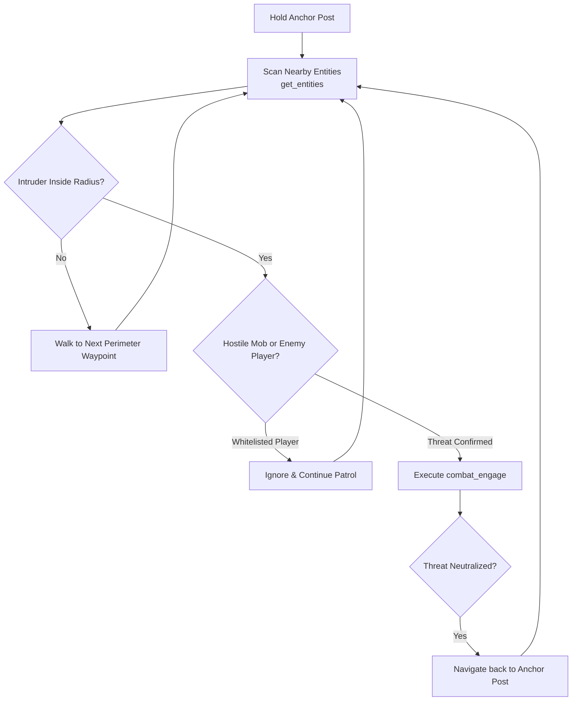

# High-Level Tool: `defend_perimeter`

The `defend_perimeter` tool initiates an autonomous sentry guard routine around a designated perimeter anchor, intercepting unauthorized players and hostile mobs before returning to post.

---

## 1. Concept & Rationale

When defending a base or protectee, an agent needs continuous territorial vigilance. Rather than requiring the LLM to repeatedly query entity lists every second, `defend_perimeter` maintains a sentry loop: patrolling waypoints, scanning for intruders, executing targeted intercepts, and returning to the anchor post.

---

## 2. Parameter Schema

```json
{
  "$schema": "http://json-schema.org/draft-07/schema#",
  "title": "defend_perimeter_parameters",
  "type": "object",
  "properties": {
    "center": {
      "type": "array",
      "items": {"type": "integer"},
      "minItems": 3,
      "maxItems": 3,
      "description": "Perimeter anchor coordinates [x, y, z]."
    },
    "radius": {
      "type": "number",
      "minimum": 5.0,
      "maximum": 50.0,
      "default": 20.0,
      "description": "Guard zone radius in blocks."
    },
    "whitelist": {
      "type": "array",
      "items": {"type": "string"},
      "default": [],
      "description": "List of player usernames exempted from engagement."
    },
    "target_hostile_mobs": {
      "type": "boolean",
      "default": true,
      "description": "Automatically eliminate Creepers, Zombies, Skeletons, Spiders entering perimeter."
    },
    "target_unauthorized_players": {
      "type": "boolean",
      "default": true,
      "description": "Engage any players not in the whitelist."
    },
    "duration_seconds": {
      "type": "integer",
      "minimum": 10,
      "maximum": 300,
      "default": 60,
      "description": "How long to maintain active guard before yielding control back to LLM."
    }
  },
  "required": ["center"]
}
```

---

## 3. Composed Primitive Sequence



---

## 4. Return Value Schema

```json
{
  "status": "completed",
  "anchor": [100, 64, 200],
  "radius": 20.0,
  "patrol_time_seconds": 60.0,
  "threats_detected": 3,
  "threats_neutralized": [
    {"type": "zombie", "id": "e4f1a...", "distance": 14.2},
    {"type": "creeper", "id": "b8c3d...", "distance": 9.8}
  ],
  "intruders_escaped": 1,
  "current_position": [100.1, 64.0, 200.4],
  "agent_health": 18.0
}
```

---

## 5. LLM Call Example

```json
{
  "name": "defend_perimeter",
  "arguments": {
    "center": [100, 64, 200],
    "radius": 25.0,
    "whitelist": ["Steve", "Notch"],
    "target_hostile_mobs": true,
    "target_unauthorized_players": true,
    "duration_seconds": 120
  }
}
```

